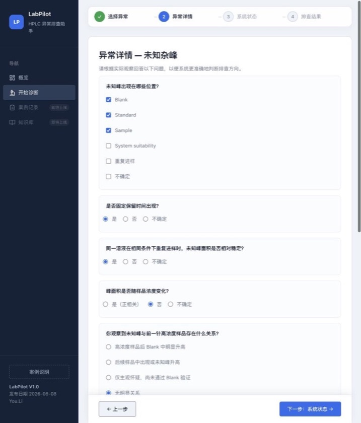
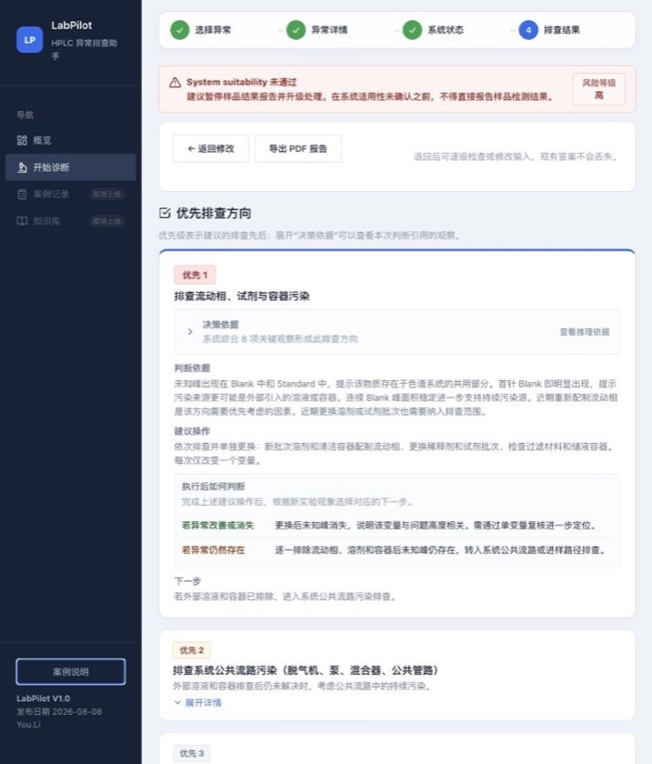

# LabPilot — HPLC 异常排查助手

## 项目概览

LabPilot 把零散的实验观察整理成有优先级、可复核、可继续推进的 HPLC 异常排查路径，帮助研发人员决定下一步先查什么、每次验证哪个变量，以及根据新结果如何继续。

- **目标用户：** HPLC 研发人员、实验室主管或复核人员，以及参与异常评估的 QA。
- **当前实现：未知杂峰。** 这是 LabPilot 首个完整实现和验收的场景，不限定后续产品范围。
- **在线体验：** https://youli-laura.github.io/labpilot-hplc-assistant/

### 我的职责与协作方式

You.Li 负责产品定义、HPLC 排查逻辑梳理、规则取舍、交互验收和测试场景确认；AI 编程工具参与前端实现、自动化测试与文案迭代，最终功能与业务表达由 You.Li 审核。

## 从一次虚构案例看完整流程

HPLC（高效液相色谱）用于分离和分析混合物中的不同成分，可用于含量测定、杂质分析、纯度评价和手性纯度分析等任务。本项目关注分析过程中出现未知峰后，如何把 Blank、Standard、Sample、保留时间和系统状态等观察放在一起，安排排查顺序。

### 1. 把异常描述拆成结构化观察



- **输入观察：** 未知峰同时出现在 Blank、Standard 和 Sample，首针 Blank 即明显出现，连续 Blank 峰面积稳定，并且近期重新配制过流动相。

### 2. 给出优先方向和可继续执行的路径



- **优先方向：** 先排查流动相、试剂与容器污染。
- **后续分支：** 若更换后未知峰消失，则进行单变量复核；若仍然存在，则转向公共流路或进样路径。

案例与截图全部使用虚构数据，不包含真实公司、样品、批号或保密实验信息。

## 三个关键产品决策

### 1. 按判断依赖分步采集

先确认异常表现和序列观察，再补充近期变更与系统状态。生成结果前进行输入冲突检查，例如 Blank 观察与峰出现位置不一致时先提示修正，避免矛盾信息直接进入规则判断。

### 2. 首屏最多展示三个优先方向

异常可能原因很多，但用户当前需要的是下一步先做什么。结果页把最值得优先验证的方向限制在三项以内，其余方向放入折叠区域，降低首屏信息负担，同时保留完整排查范围。这是当前产品的设计取舍，并非已经通过用户研究证明的结论。

### 3. 建议必须能回看，也必须能继续

每个排查方向同时展示引用的观察、建议操作，以及“异常改善或消失 / 异常仍然存在”两条后续路径。SST 未通过等停止条件优先于普通建议，避免用户把排查输出直接用于不合适的结果报告。

## 验证范围与当前边界

自动化测试覆盖典型污染、Carryover、样品相关和信息不足等规则路径，以及输入冲突、优先方向排序、SST 停止护栏、结果页交互、PDF 导出、响应式布局和公开发布安全。相同输入应得到一致输出，排查结果不得引用用户未提供的实验观察。

自动化测试验证规则和交互按设计运行，不证明实际实验效率提升，也不代表所有专业判断已经完成现场验证。LabPilot 提供排查辅助，不替代 SOP、QA、偏差调查或质量结论；实际操作仍应遵循实验室批准的程序。

## 技术实现

- 原生 HTML、CSS 与 ECMAScript Modules；
- 确定性规则组织输入校验、优先级、依据和后续分支；
- PDF 在浏览器本地生成，不向第三方接口发送实验观察；
- Node.js 内置测试运行器；
- GitHub Pages 静态部署。

## 本地运行

```bash
npm start
```

然后访问 `http://127.0.0.1:4175/`。

## 测试

```bash
npm test
```

## 版权与使用许可

Copyright © 2026 You.Li. All rights reserved.

本项目公开展示，供产品体验与技术交流。代码公开可见，但不是开源软件。除 GitHub 服务条款或适用法律明确允许的范围外，未经 You.Li 事先书面授权，不得复制、修改、再发布、再许可、商业使用或基于本项目制作衍生产品。

完整条款见 [LICENSE](./LICENSE)。仓库内的第三方组件继续适用其各自许可证；PDF 依赖的许可信息见 [第三方 MIT 许可证](./src/vendor/html2pdf.LICENSE.txt)。
